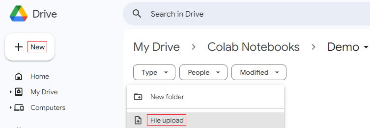
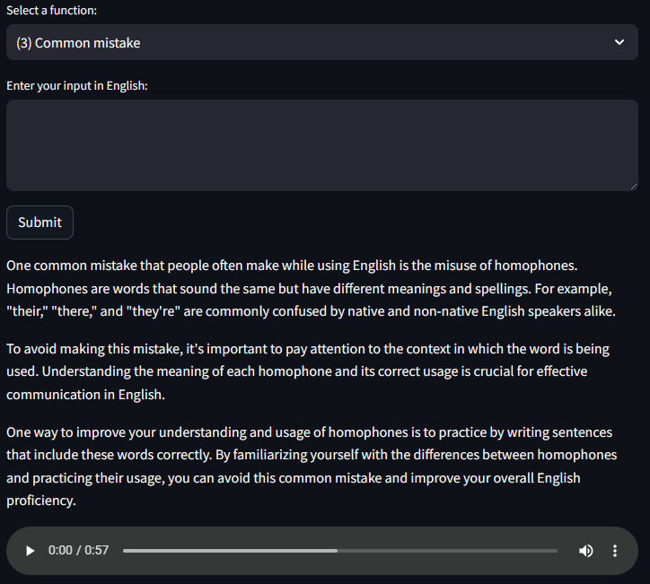

**21CNTThuc - Xử lý ngôn ngữ tự nhiên ứng dụng**  
**Group 5 - Teach me**  
19127620 - Nguyễn Văn Vũ Tường  
20127349 - Trần Quốc Thuận

**Project ID "H.11" - AI English Tutor**  
In order to run the tutor, you will need:
* A Google account
* "AI English Tutor.ipynb"
* "api.py"
* An OpenAI API key
* An ElevenLabs API key (optional)

When you have everything above, please follow these steps:  
**Step 1**: Upload "AI English Tutor.ipynb" to Google Drive.  

**Step 2**: Open "AI English Tutor.ipynb" with Google Colaboratory.  

**Step 3**: Click on "Connect".  

**Step 4**: Run cell 1 and cell 2.  
  

**Step 5**: Enter your OpenAI API key and ElevenLabs API key in cell 3.  

**Step 6**: Upload "api.py" to the "backend" folder in order to replace the old "api.py".  

**Step 7**: Run cell 3, cell 4, cell 5.  
  
  

**Step 8**: Open the third URL in cell 5.  

**Step 9**: The "Tunnel Password" is the IP address in cell 4. Submit it.  
  

**Step 10**: You can now interact with the tutor using the drop-down menus, input field, and submit button.  

Here are a few examples:  
**Example 1**:  

**Example 2**:  

**Example 3**:  

**Example 4**:  

**Example 5**:  

**Example 6**:  

Example 7 and example 8 can use input from:  
https://ielts-academic.com/category/ielts-writing/task-2/sample-answers-task-2/

**Example 7**:  
  

**Example 8**:  
Question:  
The car is a disastrous 20th Century invention that has made the world’s cities more dangerous and polluted, as well as being responsible for the deaths of millions of people in accidents. Do you agree or disagree?  

Answer:  
The car has certainly had some negative publicity in recent decades. Automobiles have been blamed for many of the problems that affect our cities, such as air pollution, traffic accidents, and the disappearance of traditional communities. Although the statement is a controversial one, I have to agree that the automobile has been a disastrous invention.  

First, there is no doubt that cities have been transformed by cars, with mostly negative consequences. The streets of most European cities, for example, were built long before the invention of the automobile and were never designed for heavy traffic. As a result, we see narrow roads crowded with vehicles, while pedestrians are restricted to pavements for their own safety. The fact that some cities have banned cars and pedestrianised their urban centres is a clear indicator that automobiles pose a danger to our cities.  

Furthermore, in both urban and rural areas, cars have proved deadly to human beings. Not only are thousands of people killed each year in road accidents, but there are also long-term health problems caused by vehicle emissions. The automobile industry has tried to respond to both problems with the development of car safety features and cleaner engines, but even these gains are offset by the increasing number of people worldwide who want to drive. Therefore, it is no exaggeration to say that the cult of vehicle ownership has become a monster beyond our control.  

In conclusion, despite widespread advertising that tries to persuade us that cars bestow status and freedom, the truth is actually that cars have been detrimental to our lifestyles and communities for many decades. Historians in the future may look back on our time and wonder why we allowed such a dangerous and inefficient form of transportation to persist unchecked. I look forward to the day when viable alternatives replace automobiles once and for all.

